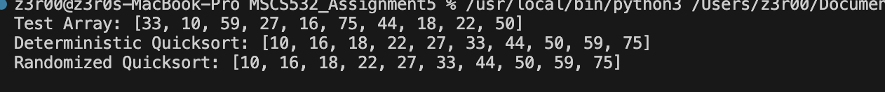
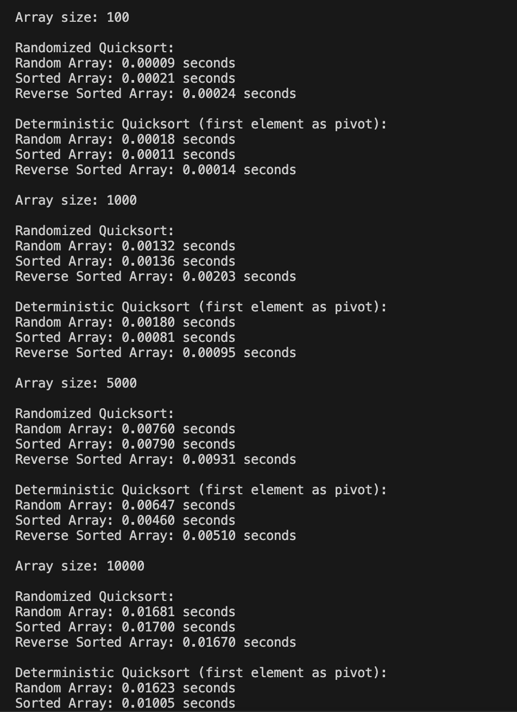

                                    QuickSort Implementation

FileName: QuickSort.py
Overview: The file contains implementation of quicksort algorithm by selecting middle elements as pivot,
        implementation of Randomized quicksort where the pivot is chosen randomly,
        implementation of time-comparison between Randomized Quicksort and Deterministic Quicksort, and
        test cases for all the implementation.
Output:  To get the output of the code, simply run the code in VSC. Below is the screenshot of the output:
Output of sorted array using both randomized and deterministic algorithm:

Output of time-comparison between randomized and deterministic algorithm in different input sizes:

